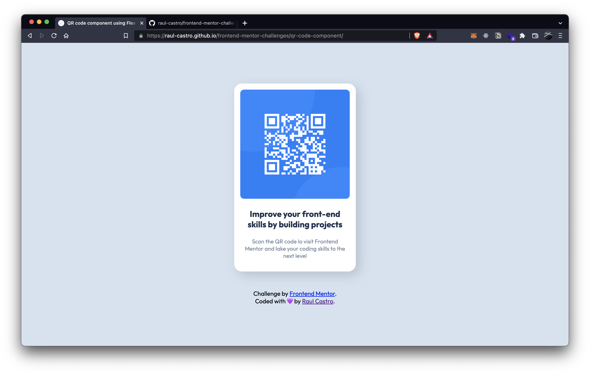

# Frontend Mentor - QR code component solution

## Hey👋

This is my solution to the [QR code component challenge on Frontend Mentor](https://www.frontendmentor.io/challenges/qr-code-component-iux_sIO_H). Frontend Mentor challenges help you improve your coding skills by building realistic projects.

## Table of contents

- [Overview](#overview)
  - [Screenshot](#screenshot)
  - [Links](#links)
- [My process](#my-process)
  - [Built with](#built-with)
  - [What I learned](#what-i-learned)
  - [Continued development](#continued-development)
  - [Useful resources](#useful-resources)
- [Author](#author)
- [Acknowledgments](#acknowledgments)

## Overview

### Desktop screenshot



### Mobile screenshot


### Links

- Solution URL: [Github](https://github.com/raul-castro/frontend-mentor-challenges/tree/main/qr-code-component)
- Live Site URL: [Github Pages](https://raul-castro.github.io/frontend-mentor-challenges/qr-code-component/)

## My process

### Built with

- Semantic HTML5 markup
- CSS custom properties using BEM
- Flexbox
- CSS Grid
- Mobile-first workflow

### What I learned

Thanks to this challenge I've learned more about semantic HTML5 tags, to use CSS BEM(Block, Element, Modifier) name convention for the classes and last but not least a better git-github workflow also regarding posting this challenge. And finally a little approach of deploying on Github pages

😅 Here is the arcane on how to center a div

```css
.container {
	display: grid;
	place-items: center;
}
```

### Continued development

For the moment i want to focus more on the basics and when I'll gain more confidence I will move to various frameworks

### Useful resources

- [BEM101](https://css-tricks.com/bem-101/) : This helped me to have a 'pattern' to follow when I name the classes in html and to give more sense to my css
- [GithubDocs](https://docs.github.com/en/pages/getting-started-with-github-pages/creating-a-github-pages-site): This is about deploying on github pages

## Author

- Github - [raul-castro](https://github.com/raul-castro)
